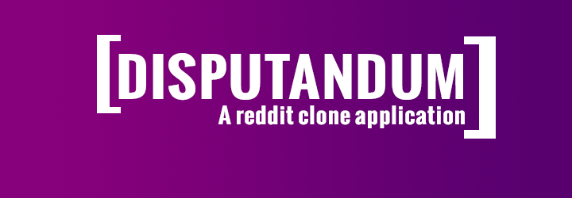

# Disputandum

Disputandum is a full stack application, inspired by Reddit, that I wrote to learn more about Node.js, React, and NoSQL databases. The name disputandum comes from the Latin and means debate).

Application uses MongoDB to store its data, and Mongoose for its asynchronous communication between the application and the database. For testing I use the [Enzyme package](https://enzymejs.github.io/enzyme/).

The application also uses reducers along with Redux to manage state in the app. In the UI the app is based off styled components to keep thing a bit tidier and easier to debug and develop further.


## Installation

### Prerequisites

* node
* npm
* mongodb

1. Clone this repository

2. Install server dependencies
    ```bash
    $ cd server
    $ npm install
    ```
3. Install client dependencies
    ```bash
    $ cd client
    $ npm install
    ```

## Run the app

1. Start mongodb locally
    ```bash
    $ mongod
    ```
2. Start the server
    ```bash
    $ cd server
    $ npm start
    ```
3. Start the client
    ```bash
    $ cd client
    $ npm start
    ```
4. Browse to `http://localhost:3000/`

## Testing

### Server
Make sure mongodb is running before testing the server.
```bash
$ cd server
$ npm test
```

### Client
```bash
$ cd client
$ npm test
```

## License

This project is made available under the **MIT License**. Feel to do anything with it :)
